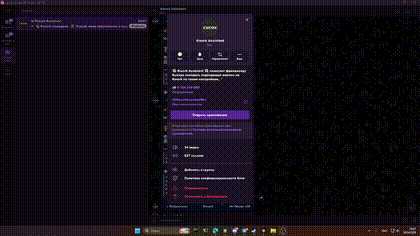
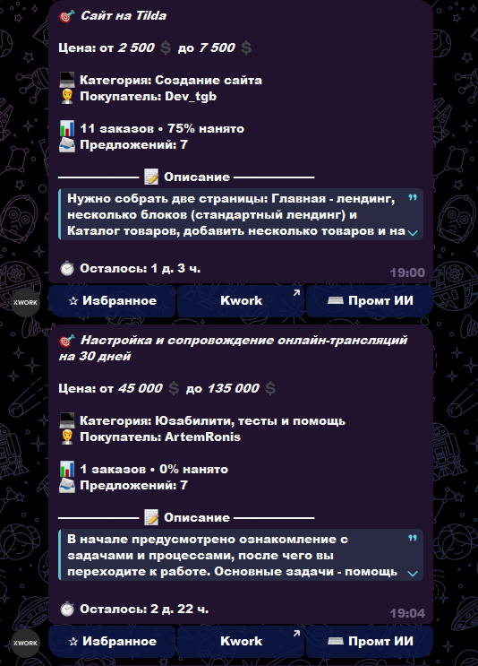
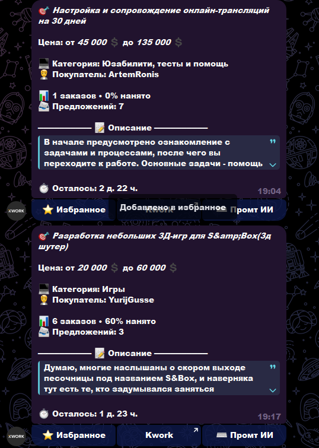
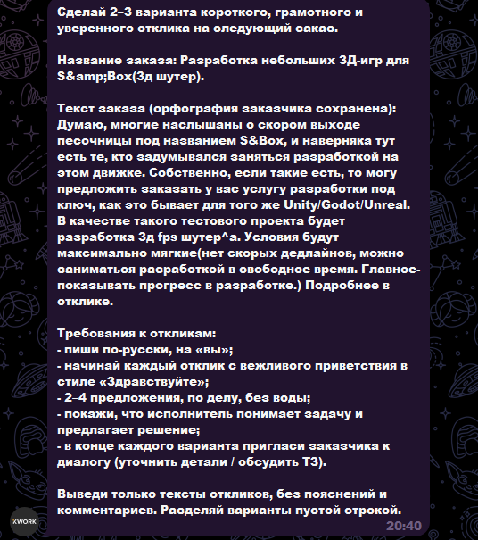
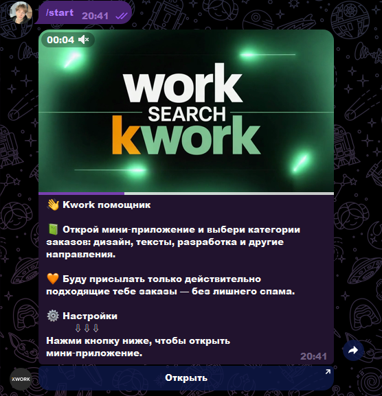

# Kwork Orders Finder (Telegram Mini App)

> [!IMPORTANT]
> **Публикация:** в репозитории только описание и медиа. **Исходный код не публикуется** (личный проект).

## 💡 Кратко

Личный Telegram‑проект для поиска подходящих заказов на Kwork: мини‑приложение с лентой заказов, фильтрацией, избранным и встроенным AI‑промптом для быстрого составления откликов.

## ✅ Что реализовано

- стартовый сценарий через `/start` и отдельную кнопку открытия mini app;
- карточки заказов с ключевыми полями (цена, категория, покупатель, статистика, описание, дедлайн);
- режим **Избранное** с переключением состояния карточек;
- экран **Промт ИИ** для генерации вариантов отклика под конкретный заказ;
- навигация внутри интерфейса: Kwork / Избранное / Промт ИИ;
- демонстрационный видеоролик открытия мини‑приложения из Telegram.

## 🧰 Технологии

| Категория | Стек |
|-----------|------|
| Платформа | Telegram Mini App |
| Язык | Python |
| Интерфейс | Telegram Web App UI |
| Интеграции | Kwork (парсинг/поиск), AI-помощник для откликов |
| Деплой | Бот + mini app связка |

## 🎬 Видео мини‑аппы

Видео открытия mini app и перехода в интерфейс:

  

Клик по превью открывает оригинальное видео: [`docs/05-miniapp.mp4`](docs/05-miniapp.mp4).

Для плавного просмотра прямо в GitHub используйте облегченный ролик: [`docs/05-miniapp-web.mp4`](docs/05-miniapp-web.mp4) (720p, 30 fps).

## 🖼️ Скриншоты интерфейса

## Исходный код

> [!NOTE]
> Код не включен в публичный репозиторий. В открытом доступе только описание и материалы для портфолио.

## Лицензия

> [!CAUTION]
> Описание и медиа — для портфолио. Повторное использование реализации без согласования не предполагается.
